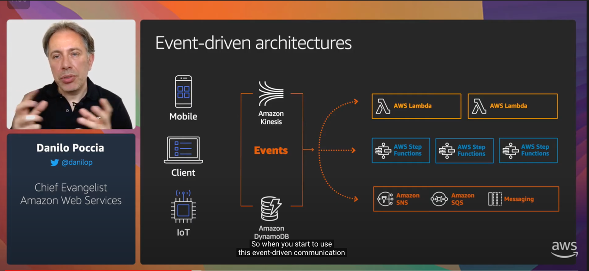
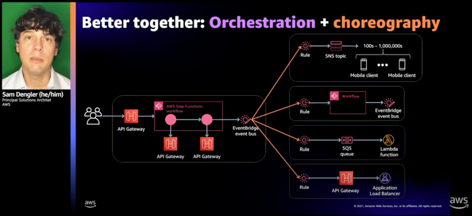

[[English](README.md)] [[한국어](README.ko.md)]

# EDA (Event-Driven Architecture) Blueprint
Event-driven architecture is common in modern applications built with microservices, and it is the cornerstone for designing serverless workloads. It uses events to trigger and communicate between decoupled services. This is EDA Blueprint example helps you compose complete AWS serverless resources that are fully bootstrapped with the operational software that is needed to deploy and operate asynchronous event-driven workloads. With this EDA Blueprint example, you describe the configuration for the desired state of your EDA environment, such as the control plane, event bus, task runners, and observability tools, as an Infrastructure as Code (IaC) template/blueprint. Once a blueprint is configured, you can use it to stamp out consistent environments across multiple AWS accounts and Regions using your automation workflow tool, such as Jenkins, CodePipeline. Also, you can use EDA Blueprint to easily bootstrap an EDA application with a wide range of popular open-source tools additionally. EDA Blueprints, composed of AWS managed services, can also help you enforce the relevant security controls you need.



## Setup
### Download
Download this example on your workspace
```sh
git clone https://github.com/Young-ook/terraform-aws-eventbridge
cd terraform-aws-lambda/examples/blueprint
```

Then you are in **blueprint** directory under your current workspace. There is an exmaple that shows how to use terraform configurations to create and manage an serverless services and utilities for EDA application on your AWS account. Check out and apply it using terraform command. If you don't have the terraform and aws cli tools in your environment, go to the main [page](https://github.com/Young-ook/terraform-aws-eventbridge) of this repository and follow the installation instructions before you move to the next step.

Run terraform:
```
terraform init
terraform apply
```
Also you can use the *-var-file* option for customized paramters when you run the terraform plan/apply command.
```
terraform plan -var-file fixture.tc1.tfvars
terraform apply -var-file fixture.tc1.tfvars
```

## Orchestration
## Choreography


## Applications
- [AWS Lambda with Amazon API Gateway](apps/README.md#amazon-api-gateway)

## Clean up
To destroy all infrastrcuture, run terraform:
```
terraform destroy
```

If you don't want to see a confirmation question, you can use quite option for terraform destroy command
```
terraform destroy --auto-approve
```

**[DON'T FORGET]** You have to use the *-var-file* option when you run terraform destroy command to delete the aws resources created with extra variable files.
```
terraform destroy -var-file fixture.tc1.tfvars
```

# Additional Resources
## Amazon DynamoDB
- [Using Lambda with API Gateway](https://docs.aws.amazon.com/lambda/latest/dg/services-apigateway-tutorial.html)

## Amazon EventBridge
- [Building an event-driven application with Amazon EventBridge](https://aws.amazon.com/blogs/compute/building-an-event-driven-application-with-amazon-eventbridge/)
- [Building an IAM Role swithcing tracker using Amazon EventBrdige andn AWS Lambda](https://github.com/Young-ook/terraform-aws-passport/tree/main/examples/role-switching-tracker)

## AWS Lambda
- [Lambda quotas](https://docs.aws.amazon.com/lambda/latest/dg/gettingstarted-limits.html)
- [Reserved concurrency](https://docs.aws.amazon.com/lambda/latest/dg/configuration-concurrency.html)

## AWS StepFunctions
- [Use AWS Step Functions to Monitor Services Choreography](https://aws.amazon.com/blogs/architecture/use-aws-step-functions-to-monitor-services-choreography/)
