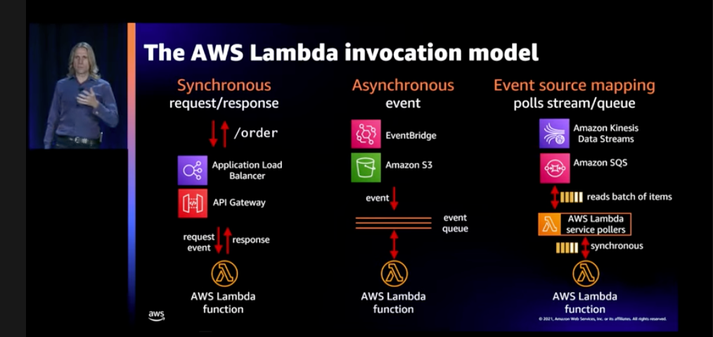

# AWS Lambda
[AWS Lambda](https://aws.amazon.com/lambda/) is a serverless compute service that lets you run code without provisioning or managing servers, creating workload-aware cluster scaling logic, maintaining event integrations, or managing runtimes. With Lambda, you can run code for virtually any type of application or backend service - all with zero administration.

