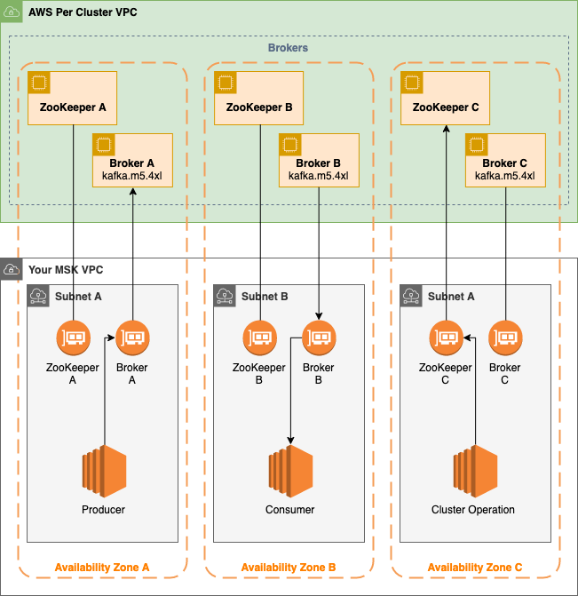

# Amazon Managed Streaming for Apache Kafka (MSK)

[Amazon Managed Streaming for Apache Kafka (Amazon MSK)](https://aws.amazon.com/msk) is a fully managed service that enables you to build and run applications that use Apache Kafka to process streaming data. Amazon MSK provides the control-plane operations, such as those for creating, updating, and deleting clusters. It lets you use Apache Kafka data-plane operations, such as those for producing and consuming data. It runs open-source versions of Apache Kafka. This means existing applications, tooling, and plugins from partners and the Apache Kafka community are supported without requiring changes to application code.

# Connect to Kafka
module.msk.kafka.zookeeper_connect_string
module.msk.kafka.bootstrap_broker_tls
